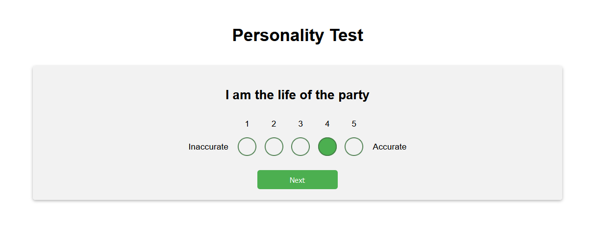

# personality-tests
The easiest way to build personality tests with a nice interface. Different IPIP personality questionnaires (Big Five) already implemented.

This program is intended to run locally and does NOT use a database.

## Answering questions:

