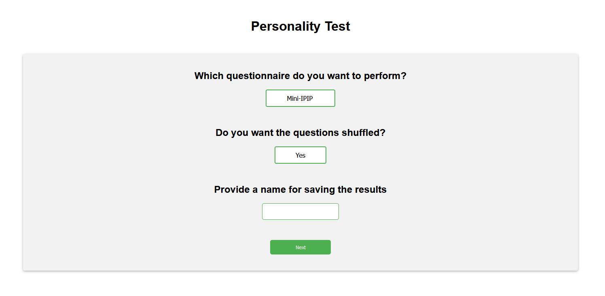

# personality-tests
The easiest way to build personality tests with a nice interface. Different IPIP personality questionnaires (Big Five) already implemented.

This program is intended to run locally and does NOT use a database.

## Questionnaires already implemented
  - MiniIPIP from https://ipip.ori.org/MiniIPIPKey.htm
  - NEO-PI-R (10-item scale) from https://ipip.ori.org/newNEODomainsKey.htm

## Selecting options:

## Answering questions:

## Results:
You get two lists with the values obtained for each of the Big Five traits:
  - The values on a scale from -1 to 1
  - The values on a scale from 0 to 1

See an example in results/results.txt

